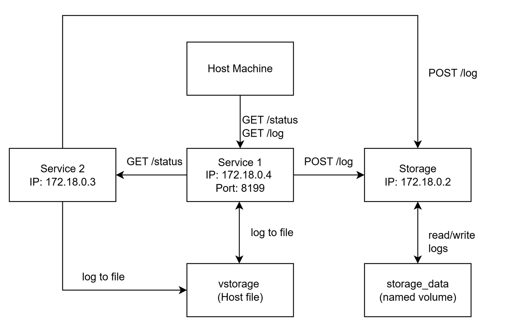

# DEVOPS - exercise1

# Multi-Service System with Persistent Storage (Service1, Service2, Storage)

This repository contains a simple system with three services, implemented in **different technologies**:

## Platform Information

- **Hardware**: Windows Laptop
- **OS**: Windows OS   
- **Docker**: 27.2.0 
- **Docker Compose**: v4.34.x - desktop 
- Git  
- .NET 9 SDK (for building Service2 before containerizing, if required) 

## System Architecture

- **Service1** – Python (FastAPI)  
  - The **only service accessible from outside**.  
  - Collects system uptime and free disk space.  
  - Stores logs in:
    - Shared file volume `vstorage`
    - Storage service 
  - Forwards requests to **Service2**. 
  - Combine status from Service1 and Service2 and returns 
  - Endpoints:
    - `GET /status` → Analyze uptime , space and Append new log entry (`text/plain`)
    - `GET /log` → Retrieve all logs (`text/plain`)

- **Service2** – .NET 9 Web API  
  - Collects system uptime and free disk space.   
  - Stores logs in:
    - Shared file volume `vstorage`
    - Storage service 
  - Returns status info back to Service1. 
  - Endpoints:
    - `GET /status` → Analyze uptime , space and Append new log entry (`text/plain`) 

- **Storage** – Node.js (Express)  
  - Simple REST API for persistent logs.  
  - storage_data: a named Docker volume mounted only into Storage at `/app/data` and used to persist its internal `log.txt`.
  - Persists logs between container restarts using Docker volumes.  
  - Endpoints:
    - `POST /log` → Append new log entry (`text/plain`)
    - `GET /log` → Retrieve all logs (`text/plain`)

- **vstorage** – host file `./vstorage` mounted into Service1 and Service2 at `/app/vstorage` and appended per request. This is the simple shared file method. 
 
- **Networking** 
- A single user-defined `services_network` network connects all three services. Only Service1 publishes a host port.
 
## Analysis of Status Records
- **Timestamp**: Using ISO 8601 UTC (`2025-09-28T13:05:35Z`) format as required.
- **Uptime**: Both services report container uptime i.e service starting time and convert to hours with two decimal places.
- **Disk space measurement**: 
  - Service1: Reads free disk space on the root filesystem (`/`) in MB using shutil library.
  - Service2: Reads free disk space on the root filesystem (`/`) in MB using the driveinfo (`/` on `Linux`, `C:\` on `Windows`).

**Measurement relevance**: 

  - Uptime shows how long the container has been running, not the host.
  - Disk space reflects the container’s root filesystem, which may differ from the host OS storage.
  - Monitor total system resources, such as CPU, memory usage percentages, and container health metrics.

## Storage Comparison

1. **Host file binding (./vstorage)** 
   - **Pros**: 
     - Simple to implement
     - Easy to view and edit files directly on the host (./vstorage)
     - Code changes on host reflect instantly inside the container
     - Persists between container restarts
   - **Cons**: 
     - File must exist on the host, moving between environments (Linux/Windows/VM/CI) can break.
     - Less secure (host file exposed)
     - Slower than named volumes.
     - Could cause permission issues between containers and host
     - Less isolation and Considered bad practice in production
     

2. **Docker named volume (storage_data)**
   - **Pros**: 
     - Docker manages it fully
     - Portable between different environments (Linux/Windows/VM/CI)
     - Faster than host file
     - Better isolation and security
     - Data persists beyond container lifecycle
   - **Cons**: 
     - Requires explicit management commands to inspect or clean
     - More complex to access from outside Docker
     - Depends on docker life cycle

## How to Run
 
- Clone the repository using command: `git clone -b exercise1 https://github.com/LokeswariMelapattu/devops-course.git`
- `cd devops-course`
- Build and start: `docker-compose up --build -d` 
- Test status flow: `curl localhost:8199/status`
- Fetch first storage log : `curl localhost:8199/log`
- Fetch second storage log : `cat ./vstorage`
- Stop: `docker-compose down`

### Cleanup instructions
- Clean the logs from host-file storage: `> ./vstorage`
- Remove the named volume for Storage: `docker volume rm devops-course_storage_data`

## Challenges and Problems 
  - Understanding the difference between container vs host measurements.
  - Configuring networking between containers in VirtualBox and Docker
  - Managing persistent storage across bind mounts and Docker volumes
  - Permission issues for creating hostfile
  - A key challenge was maintaining service isolation while enabling necessary inter-service communication. To achieve this, I created a custom services_network and exposed only the Service1 port externally.

